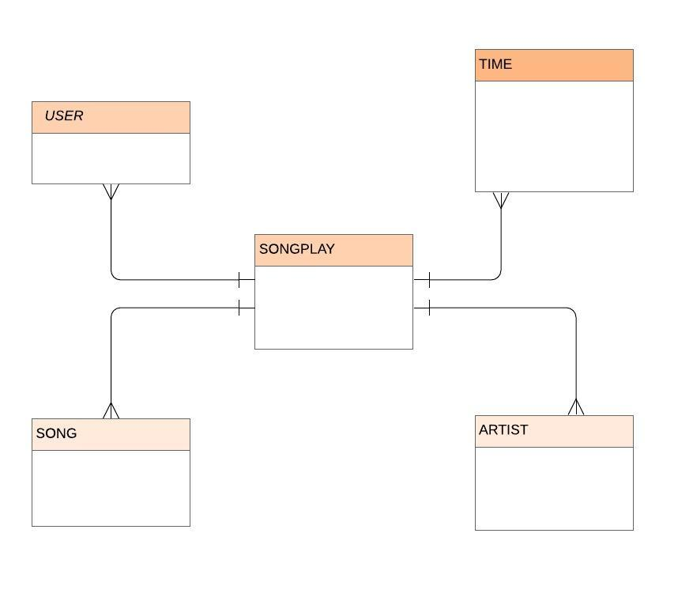

### PROJECT SUMMARY:
 A fictitious music streaming startup, Sparkify has matured. Their data resides in S3, in a directory of JSON logs on user activity on the app, as well as a directory with JSON metadata on the songs in their app. This project load songs and logs data from given s3 buckets. Process them using spark and upload it back to s3 bucket.
  
### Database schema and ETL:  
 The project creates the fact and dimensions tables in star schema format from logs and songs metadata files. It loads these files from S3. Process them using spark. And then load back new tables in s3.
 

### Files:  
 etl.py - Contains the logic for extracting, tranforming, and loading the logs and songs metadata
 dl.cfg - Contains aws configurations.
 data - Conatains small dataset to work locally
 images - Contains images for readme file.
 
### How to run Project:
  From notebook launcher, launch a terminal and run:
  
  ``` python3 etl.py```

